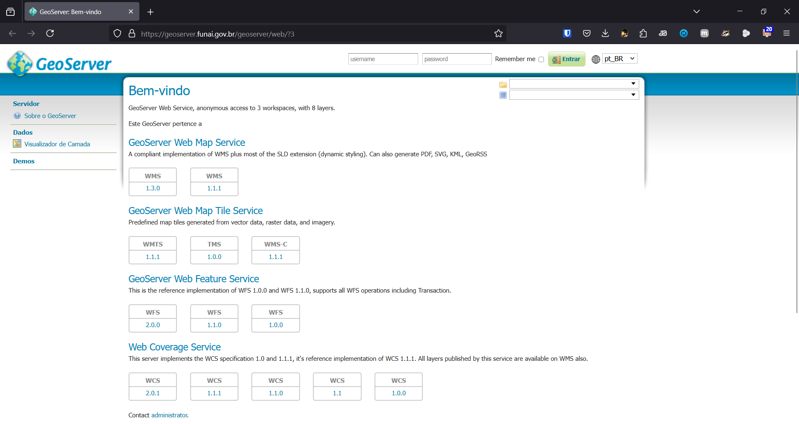

# GeoServer

O [GeoServer](https://geoserver.org/) é uma aplicação _open source_ para compartilhamento, edição e visualização de dados geoespaciais na web. Ele é amplamente utilizado em Sistemas de Informação Geográfica (SIG) e suporta diversos padrões abertos definidos pelo [Open Geospatial Consortium (OGC)](https://www.ogc.org/), tais como:

- WMS (Web Map Service) – para visualização de mapas.
- WFS (Web Feature Service) – para acesso a dados vetoriais.
- WCS (Web Coverage Service) – para acesso a dados raster.
- CSW (Catalog Service for the Web) – para metadados.

O [_GeoServer_](https://geoserver.org/) é uma maneira de disponibilizar dados geográficos. Existem dezenas de _GeoServers_ de instituições públicas disponibilizando dados na internet. Usualmente, quando encontramos um GeoServer na internet, nos deparamos com essa interface abaixo.

 

O endereço da interface _web_ termina com "web". Precisamos substituir por "ows" para trabalhar com o pacote [OWSLib](https://owslib.readthedocs.io/en/latest/).

Por meio do pacote [OWSLib](https://owslib.readthedocs.io/en/latest/) é facilitado o acesso aos dados de um GeoServer.

> GeoServer includes several types of OGC services like WCS, WFS and WMS, commonly referred to as “OWS” services.

- https://geoserver.funai.gov.br/geoserver/web/
- https://geoserver.funai.gov.br/geoserver/ows/

 

---

## GeoServer

Abaixo listo alguns apenas para exemplificar:

## BR

- https://geoservicos.ibge.gov.br/geoserver/web/
- https://geoserver.funai.gov.br/geoserver/web/
- https://geoservicos.inde.gov.br/geoserver/web/
- https://servicos.dnit.gov.br/dnitgeo/geoserver/web/
- https://geoserver.mdr.gov.br/geoserver/web/
- https://geoinfo.dados.embrapa.br/geoserver/web/

 

## SP

- https://geodados.daee.sp.gov.br/geoserver/web/
- http://datageo.ambiente.sp.gov.br/geoserver/web/

 

## Outros

- http://geoserver.pr.gov.br/geoserver/web/
- https://ide.geobases.es.gov.br/geoserver/web/
- https://egov.santos.sp.gov.br/geoserver/web/
