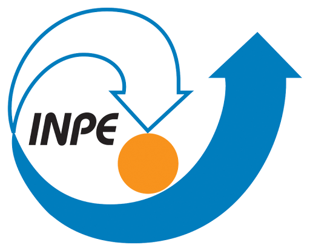
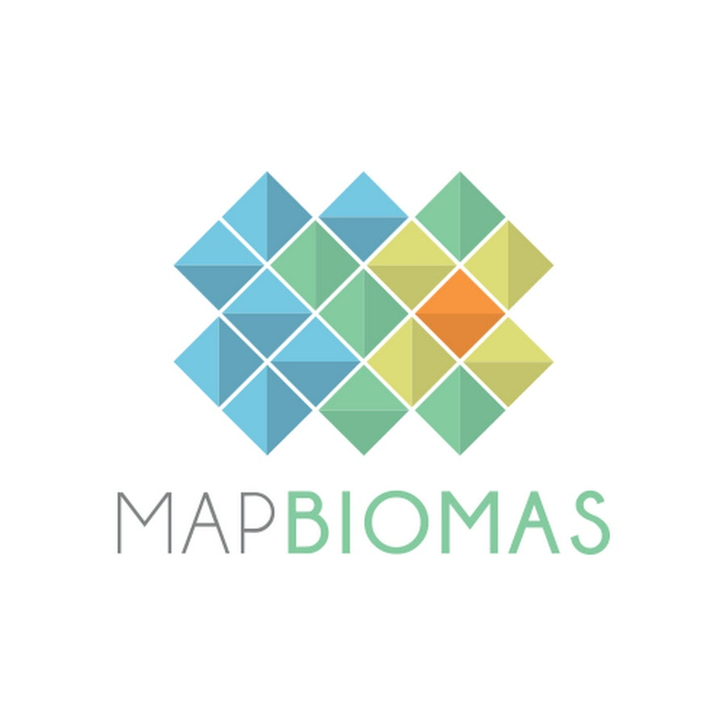
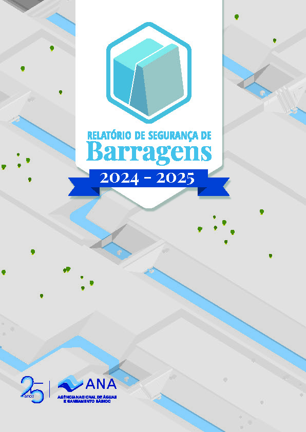
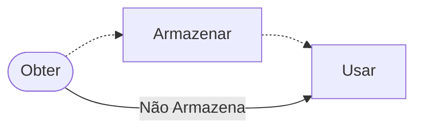

# Open Geodata

[](https://github.com/michelmetran/open-geodata)
[](https://pypi.org/project/open-geodata/)<br>
[](https://open-geodata.readthedocs.io/pt/latest/)
[](https://github.com/michelmetran/open-geodata/actions/workflows/publish-to-pypi-uv.yml)

O **_Open Geodata_** tem como objetivo facilitar o acesso à dados espaciais de instituições públicas e privadas do Brasil. Algumas das instituições são apresentadas abaixo:

<div align="center"> 
<a href="./pages/dados/br/amn/" target="_blank">

</a>
<a href="./pages/dados/br/aneel/" target="_blank">

</a>
<a href="./pages/dados/br/bdgex/" target="_blank">

</a>
<a href="./pages/dados/br/cnuc_pooch/" target="_blank">

</a>
<a href="./pages/dados/br/dnit_geoserver/" target="_blank">

</a>
</div>

<div align="center">
<a href="./pages/dados/br/funai_geoserver/" target="_blank">

</a>
<a href="./pages/dados/br/ibama_geoserver/" target="_blank">

</a>
<a href="./pages/dados/br/ibge_class/" target="_blank">

</a>
<a href="./pages/dados/br/inpe_geoserver/" target="_blank">

</a>
<a href="./pages/dados/br/inde_geoserver/" target="_blank">

</a>
</div>

<div align="center">
<a href="./pages/dados/br/iphan_geoserver/" target="_blank">

</a>
<a href="./pages/dados/br/map_biomas/" target="_blank">

</a>
<a href="./pages/dados/br/mdr_geoserver/" target="_blank">

</a>
<a href="./pages/dados/br/sfb/" target="_blank">

</a>
<a href="./pages/dados/br/snisb/" target="_blank">

</a>
</div>

<br>

---

## Dependências

O projeto tem como dependêcias pacotes para obtenção de diferentes tipos de dados, bem como define funções e classes para obtenção de dados específicos.

As principais dependências utilizadas pelo **_Open Geodata_** para obter dados espaciais são:

- [Pooch](https://www.fatiando.org/pooch/latest/), trata-se de um biblioteca _python_, [_opensource_](https://github.com/fatiando/pooch), do projeto chamado [Fatiando a Terra](https://www.fatiando.org/). Tomei conhecimento ao vê-lo como dependência da biblioteca [geopandas/**geodatasets**](https://github.com/geopandas/geodatasets).
- [OWSlib](https://owslib.readthedocs.io/en/latest/) é uma biblioteca _python_, de [_opensource_](https://github.com/geopython/OWSLib), que fornece uma interface comum para interagir com diversos serviços _web_ geoespaciais baseados em padrões OGC ([_Open Geospatial Consortium_](https://www.ogc.org/)), tais como: WMS, WFS, WCS, WMTS, CSW entre outros.
- [Bolton & Menk GIS/restapi](https://github.com/Bolton-and-Menk-GIS/restapi), biblioteca _opensource_ projetada para funcionar com os serviços REST do ArcGIS Server, para consultar e extrair dados, além de visualizar propriedades de serviço.
- [ArcGIS API for Python](https://developers.arcgis.com/python/latest/), biblioteca proprietária (da [ESRI](https://www.esri.com/)), disponibilizada no [PyPI](https://pypi.org/project/arcgis/), utilizada para consumir dados do ArcGIS Server.

<br>

Ainda, a documentação é parte fundamental da biblioteca _Open Geodata_, onde são apresentados exemplos e maneiras de usar a biblioteca, bem como as dezenas de fontes abertas na _internet_.

!!! abstract "Inspiração: do projeto à biblioteca!"

    *Existe muita coisa disponível na *internet*: pra que querer guardar tudo no seu PC!?*

    Sempre colecionei dados espaciais e, inclusive, estudava como implantar o meu próprio [GeoServer](https://geoserver.org/). Fui vivenciando os problemas de ter dados espaciais armazenados: ocupam muito espaço e rapidamente ficam desatualizados.

    Passei a estudar maneiras de mante-los atualizados e, com isso, conheci as potencialidades do *python*. Mantinha os dados e rotinas de atualização, algumas delas disponíveis no [Projeto *Open Geodata*](https://github.com/open-geodata).
    Passado algum tempo observei que a minha real necessidade era ter apenas a rotina de atualização, obtendo o dado mais atualizado, para o uso pontual (sem consistir o dado no meu HD / sem armazena-lo): iniciei o desenvolvimento da [Biblioteca *Open Geodata*](https://github.com/michelmetran/open-geodata).

    ... uma longa trajetória, iniciada muito tempo atrás, quando se comprava "cartas do [Instituto Geográfico e Cartográfico](https://www.igc.sp.gov.br/)" na papelaria da faculdade, com *pen drive*: *good ol' days!*

<br>

---

## Como Contribuir?

Alguma dúvida, sugestão e/ou contribuição, favor reportar um [problema/_issue_](https://github.com/michelmetran/open-geodata/issues) ou abrir um tópico de [discussão](https://github.com/michelmetran/open-geodata/discussions).

É possível também criar um [pull request](https://github.com/michelmetran/open-geodata/pulls) para contrubuir diretamente com o desenvolvimento da biblioteca.

<br>

---

## Como Instalar?

O pacote está disponível no repositório oficial do _python_: [PyPI](https://pypi.org/project/open-geodata/).

```shell
# Instala usando pip
pip3 install open-geodata --upgrade

# Instala usando uv
uv add open-geodata

# Instala usando uv
poetry add open-geodata
```

<br>

---

## Diagrama



<br>

---

<body>
    <div style="text-align:center;">
        ```mermaid
        ---
        config:
            theme: mc
            look: handDrawn
            layout: dagre
        ---
        flowchart LR
            A .-> B
            B  .-> C
            A --Não Armazena --> C

            B@{ shape: cyl}
            A(["Obter"])
            B["Armazenar"]
            C["Usar"]
        ```
    </div>

</body>
